# Dispatch Log

> **Live workflow view.** Open in VS Code Markdown Preview (`Ctrl+Shift+V`) to see the agent pipeline build up in real time.
>
> Created at session start. The Orchestrator (and any agent that delegates) appends entries as sub-agents are spawned.
> Save each session's log as: `.ai/sessions/{YYYY-MM-DD}_{topic}.dispatch.md`

**Session:** {DATE} — {TOPIC}

---

## Dispatch Table

> One row per sub-agent call. Append new rows as agents are spawned.

| # | Caller | Agent Spawned | Reason (why this agent?) | Task (what should it do?) | Result |
| --- | --- | --- | --- | --- | --- |
| | | | | | |

<!-- 
HOW TO USE THIS TABLE:

Before spawning a sub-agent, the caller appends a row:
  - #: Sequential dispatch number (1, 2, 3, ...)
  - Caller: Who is dispatching (e.g., Orchestrator, Worker)
  - Agent Spawned: Which agent is being called (e.g., Architect, Critic)
  - Reason: WHY this agent is needed right now (1 sentence)
  - Task: WHAT the agent should accomplish (1-2 sentences)
  - Result: Left blank — filled in when the agent reports back (e.g., "✅ Plan v1 ready", "❌ 3 issues found")

EXAMPLES:

| 1 | Orchestrator | Architect | User requested new auth feature — need system design | Design JWT auth architecture: entities, data flow, decomposition, dedup report | ✅ Architecture plan v1 written to .ai/plans/ |
| 2 | Orchestrator | Innovator | Architecture plan ready — need creative alternatives before Critic review | Challenge assumptions in auth plan, propose 3+ alternative approaches | ✅ 3 ideas proposed, top pick: hybrid token strategy |
| 3 | Orchestrator | Architect | Innovator proposed hybrid approach — Architect should consider incorporating | Review Innovator Log, fill Architect Response, revise plan if needed | ✅ Plan v2 — adopted hybrid refresh, updated Innovator Response |
| 4 | Orchestrator | Critic | Revised plan ready — need adversarial review | Run full critique checklist on auth architecture plan v2 | ❌ REVISE — duplicate utility found, missing TTL design |
| 5 | Orchestrator | Architect | Critic found 2 issues — need fixes | Fix duplicate PasswordHasher (reuse crypto_utils), add TTL config | ✅ Plan v3 — issues resolved |
| 6 | Orchestrator | Critic | Architect fixed issues — re-review needed | Re-run critique on plan v3 | ✅ APPROVED |
| 7 | Orchestrator | Planning | Architecture approved — need function-level breakdown | Break auth plan into phased impl plans with delegatable steps | ✅ 3 phases, 9 functions, all delegatable |
-->

---

## Workflow Diagram

> This diagram grows as agents are dispatched. Each agent appends its step above `%% DISPATCH_INSERT_HERE`.

```mermaid
flowchart TD
    U["👤 User"]
    O["🎯 Orchestrator"]
    D["🔎 Discovery"]
    PL["🧠 Planning"]
    A["🏗️ Architect"]
    IN["💡 Innovator"]
    C["⚖️ Critic"]
    S["📁 Scaffolder"]
    TW["📝 Test Writer"]
    W["🔧 Worker"]
    R["🔍 Reviewer"]
    DU["📚 Doc Updater"]
    RE["🔬 Research"]

    %% === Dispatch entries are inserted below === %%
    %% Example: O -->|"task description"| A
    %% DISPATCH_INSERT_HERE
```

