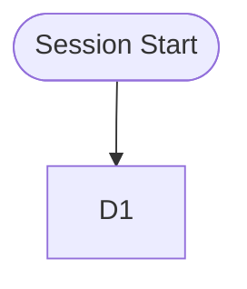

# Session Transcript

> **Full audit trail.** The Orchestrator appends to this file after every sub-agent completes.
> The Retrospective Agent reads this to audit every tool call, command, and decision.
> Open in VS Code **Markdown Preview** (`Ctrl+Shift+V`) to see the live workflow diagram.
>
> Save as: `.ai/sessions/{YYYY-MM-DD}_{topic}.transcript.md`

**Session:** {DATE} — {TOPIC}

---

## Workflow Diagram

> Updated live by the Orchestrator after every agent spawn. Open in Markdown Preview to visualize.

<!--
HOW TO UPDATE THE DIAGRAM:

After each agent spawn completes, the Orchestrator inserts a new node and edge
ABOVE the %% WORKFLOW_INSERT_HERE marker. Use this pattern:

    D{N}["{emoji} {Agent} — {task summary}"]
    D{N} --> D{N+1}

Where:
  - {N} is the dispatch number
  - {emoji} matches the agent (🔎 Discovery, 🧠 Planning, 🏗️ Architect, etc.)
  - {task summary} is 5-10 words describing what the agent did

Color the node by outcome:
  - ✅ Success:  style D{N} fill:#2ecc71,color:#fff
  - ⚠️ Partial:  style D{N} fill:#f39c12,color:#fff
  - ❌ Failed:   style D{N} fill:#e74c3c,color:#fff

Example after 3 dispatches:

    D1["📚 Librarian — Context brief for Architect"]
    style D1 fill:#2ecc71,color:#fff
    D1 --> D2
    D2["🏗️ Architect — Design auth service architecture"]
    style D2 fill:#2ecc71,color:#fff
    D2 --> D3
    D3["⚖️ Critic — Review architecture v1"]
    style D3 fill:#f39c12,color:#fff
    D3 --> D4
    %% WORKFLOW_INSERT_HERE

For parallel spawns (e.g., multiple Workers), use:
    D{N} --> D{N+1}
    D{N} --> D{N+2}
-->

---

<!-- Append one block per sub-agent dispatch. Copy the template below. -->

<!--
## Dispatch #{N} — {Agent Name}

**Timestamp:** {ISO timestamp}
**Reason:** {why this agent was spawned}

### Prompt Sent
{Key parts of the prompt sent to the sub-agent — task description, context brief, constraints}

### Response Received
{The sub-agent's full response / report}

### Tool Calls Made
| # | Tool | Target | Result |
| --- | --- | --- | --- |
| 1 | {tool name} | {file/search/command} | {outcome: success/fail/partial} |

### Terminal Commands
| # | Command | Exit Code | Notes |
| --- | --- | --- | --- |
| 1 | {command} | {0/1/…} | {any relevant output or errors} |

### Decisions Made
- {decision}: {reasoning}

### Issues Encountered
- {issue}: {how it was resolved}
-->
