# Execution Trace

> **Real-time view:** Open this file in VS Code **Markdown Preview** (`Ctrl+Shift+V`) to watch the agent pipeline build up as it runs.
>
> This file is auto-generated at the start of each session. Agents append trace lines as they execute.

**Session:** {DATE} — {TOPIC}

```mermaid
sequenceDiagram
    participant U as 👤 User
    participant O as 🎯 Orchestrator
    participant D as 🔎 Discovery
    participant PL as 🧠 Planning
    participant A as 🏗️ Architect
    participant IN as 💡 Innovator
    participant C as ⚖️ Critic
    participant S as 📁 Scaffolder
    participant TW as 📝 Test Writer
    participant W as 🔧 Worker
    participant R as 🔍 Reviewer
    participant SEC as 🔒 Security
    participant CQ as 📊 Code Quality
    participant DU as 📚 Doc Updater
    participant RE as 🔬 Research

    %% === Agent trace lines are inserted below === %%
    %% TRACE_INSERT_HERE
```



---

## Trace Legend

| Arrow | Meaning |
| --- | --- |
| `X->>Y` | X hands off to Y (synchronous) |
| `X-->>Y` | Y returns result to X |
| `X->>+Y` | X spawns Y as sub-agent |
| `Y-->>-X` | Sub-agent Y finishes and reports back |
| `Note over X` | X is doing internal work |

## How Tracing Works

Each agent inserts Mermaid sequence diagram lines into the trace block above as it works. To add a trace entry, the agent finds `%% TRACE_INSERT_HERE` and inserts new lines **above** it (keeping the marker on the last line).

### Trace Syntax Per Agent

**User → Orchestrator (start of session):**

```text
U->>O: "task description here"
```

**Discovery Agent (when new data is presented):**

```text
O->>+D: Analyze new codebase/data
Note over D: Reading all files, mapping structure
Note over D: Created discovery summary (3 layers)
D-->>-O: Discovery summary ready
```

**Architect (DEEP_MODE — always ON):**

```text
O->>+A: Design architecture
Note over A: Reading BUSINESS_LOGIC.md, discoveries, CODE_INVENTORY.md
Note over A: Designed: ModuleA, ModuleB, SharedUtils
A-->>-O: Architecture plan v1
```

**Innovator:**

```text
O->>+IN: Review plan, propose alternatives
Note over IN: Generating alternative approaches
Note over IN: Challenged 2 assumptions, proposed 3 alternatives
IN-->>-O: 3 ideas proposed
```

**Critic (DEEP_MODE — always ON):**

```text
O->>+C: Critique the plan
Note over C: Running critique checklist
C-->>-O: ❌ Rejected — duplicate utility, missing error handling
```

or on approval:

```text
O->>+C: Critique the plan
Note over C: All checks passed ✅
C-->>-O: Architecture approved
```

**Planning Agent:**

```text
O->>+PL: Create implementation plan
Note over PL: Breaking down into 3 phases, 12 functions
PL-->>-O: Plan ready — all delegatable
```

**Scaffolder Agent:**

```text
O->>+S: Scaffold phase 1 (4 files)
Note over S: Created 4 files, 12 stubs
S-->>-O: Scaffolding complete
```

**Test Writer Agent:**

```text
O->>+TW: Write tests for auth_service.py
Note over TW: auth_service.py — wrote 45 tests
TW-->>-O: Tests ready (all red)
```

**Worker Agent:**

```text
O->>+W: Implement validate_token()
Note over W: validate_token() — red-green 3 iterations
W-->>-O: ✅ All tests green
```

or on failure:

```text
Note over W: validate_token() — ❌ 5 attempts failed
W-->>-O: ❌ TypeError in line 42
```

**Reviewer Agent:**

```text
O->>+R: Review changes
Note over R: Checking duplication, playbook, preferences
Note over R: ✅ No issues found
R-->>-O: Review complete
```

**Doc Updater Agent:**

```text
O->>+DU: Update all documentation
Note over DU: Updated BUSINESS_LOGIC, CODE_INVENTORY, 3 file docs
DU-->>-O: Docs updated
```

**Research Agent:**

```text
O->>+RE: Investigate auth patterns
Note over RE: Searched codebase, found 3 relevant files
RE-->>-O: Findings ready
```
