# Execution Trace

> **Real-time view:** Open this file in VS Code **Markdown Preview** (`Ctrl+Shift+V`) to watch the agent pipeline build up as it runs.
>
> This file is auto-generated at the start of each session. Agents append trace lines as they execute.

**Session:** 2026-02-18 — Add user authentication service

```mermaid
sequenceDiagram
    participant U as 👤 User
    participant O as 🎯 Orchestrator
    participant D as 🔎 Discovery
    participant PL as 🧠 Planning
    participant A as 🏗️ Architect
    participant IN as 💡 Innovator
    participant C as ⚖️ Critic
    participant S as 📁 Scaffolder
    participant TW as 📝 Test Writer
    participant W as 🔧 Worker
    participant R as 🔍 Reviewer
    participant DU as 📚 Doc Updater

    U->>O: "Add JWT-based auth service with login, logout, and token refresh"

    O->>+A: Design architecture
    Note over A: Reading BUSINESS_LOGIC.md, CODE_INVENTORY.md
    Note over A: Designed: AuthService, TokenManager, PasswordHasher, SessionStore
    Note over A: Dedup report: http_utils exists — will reuse for API calls
    A-->>-O: Architecture plan v1

    O->>+IN: Review plan, propose alternatives
    Note over IN: Challenged assumption: JWT is best for sessions
    Note over IN: Proposed 3 alternatives (stateless tokens, session DB, hybrid)
    IN-->>-O: 3 ideas proposed — top pick: hybrid approach

    O->>+A: Incorporate Innovator's ideas
    Note over A: Adopted hybrid refresh strategy from Innovator
    A-->>-O: Architecture plan v2

    O->>+C: Critique the plan
    Note over C: Running critique checklist
    Note over C: ❌ PasswordHasher duplicates hash_string() in crypto_utils
    Note over C: ⚠️ SessionStore missing TTL expiry strategy
    C-->>-O: Rejected — duplicate utility, missing TTL design

    O->>+A: Fix issues from Critic
    Note over A: Fixed: reuse crypto_utils.hash_string(), added TTL config
    A-->>-O: Architecture plan v3

    O->>+C: Critique the plan
    Note over C: Running critique checklist
    Note over C: All checks passed ✅
    C-->>-O: Architecture approved

    O->>+PL: Create implementation plan
    Note over PL: Reading approved architecture plan
    Note over PL: Planned 3 phases, 9 functions
    Note over PL: Phase 0: config + models (2 files)
    Note over PL: Phase 1: token_manager + password utils (3 functions)
    Note over PL: Phase 2: auth_service (4 functions)
    PL-->>-O: Plan ready — 7 delegatable, 2 inline

    Note over O: Starting Phase 0 — Config & Models
    O->>+S: Scaffold phase 0 (2 files)
    Note over S: Created src/config/auth_config.py (2 constants)
    Note over S: Created src/models/user.py (1 dataclass)
    Note over S: Created tests/config/test_auth_config.py
    Note over S: Created tests/models/test_user.py
    S-->>-O: Scaffolding complete — 4 files, 5 stubs

    par Worker: auth_config
        O->>+W: Implement AUTH_TOKEN_TTL, AUTH_REFRESH_TTL
        Note over W: auth_config — 1 iteration
        W-->>-O: ✅ All tests green
    and Worker: user model
        O->>+W: Implement User dataclass
        Note over W: user.py — 1 iteration
        W-->>-O: ✅ All tests green
    end
    Note over O: Phase 0 complete ✅

    Note over O: Starting Phase 1 — Token Manager & Password Utils
    O->>+S: Scaffold phase 1 (2 files)
    Note over S: Created src/services/token_manager.py (2 functions)
    Note over S: Created src/utils/password_utils.py (1 function)
    Note over S: Created tests/services/test_token_manager.py
    Note over S: Created tests/utils/test_password_utils.py
    S-->>-O: Scaffolding complete — 4 files, 6 stubs

    par Test Writer: token_manager
        O->>+TW: Write tests for token_manager.py
        Note over TW: token_manager.py — wrote 35 tests
        TW-->>-O: Tests ready (all red)
    and Test Writer: password_utils
        O->>+TW: Write tests for password_utils.py
        Note over TW: password_utils.py — wrote 20 tests
        TW-->>-O: Tests ready (all red)
    end

    par Worker: generate_token
        O->>+W: Implement generate_token()
        Note over W: generate_token() — red-green 2 iterations
        W-->>-O: ✅ All tests green
    and Worker: validate_token
        O->>+W: Implement validate_token()
        Note over W: validate_token() — red-green 3 iterations
        W-->>-O: ✅ All tests green
    and Worker: hash_password
        O->>+W: Implement hash_password()
        Note over W: hash_password() — red-green 1 iteration
        W-->>-O: ✅ All tests green
    end
    Note over O: Phase 1 complete ✅

    Note over O: Starting Phase 2 — Auth Service
    O->>+S: Scaffold phase 2 (1 file)
    Note over S: Created src/services/auth_service.py (4 functions)
    Note over S: Created tests/services/test_auth_service.py
    S-->>-O: Scaffolding complete — 2 files, 8 stubs

    O->>+TW: Write tests for auth_service.py
    Note over TW: auth_service.py — wrote 62 tests
    TW-->>-O: Tests ready (all red)

    par Worker: login
        O->>+W: Implement login()
        Note over W: login() — red-green 3 iterations
        W-->>-O: ✅ All tests green
    and Worker: logout
        O->>+W: Implement logout()
        Note over W: logout() — red-green 1 iteration
        W-->>-O: ✅ All tests green
    and Worker: refresh_token
        O->>+W: Implement refresh_token()
        Note over W: refresh_token() — red-green 4 iterations
        W-->>-O: ✅ All tests green
    and Worker: get_current_user
        O->>+W: Implement get_current_user()
        Note over W: get_current_user() — red-green 2 iterations
        W-->>-O: ✅ All tests green
    end
    Note over O: Phase 2 complete ✅

    Note over O: Inline wiring — connected auth_service to app entry point
    Note over O: Running full test suite — 117 tests
    Note over O: All 117 tests passing ✅

    O->>+R: Review changes
    Note over R: Checking duplication, playbook, preferences
    Note over R: ✅ No duplicate symbols found
    Note over R: ✅ Playbook patterns followed
    Note over R: ✅ All functions have doc comments
    R-->>-O: Review complete

    O->>+DU: Update all documentation
    Note over DU: Updated CODE_INVENTORY.md (+9 symbols)
    Note over DU: Updated docs/files/services/auth_service.md
    Note over DU: Updated README.md
    DU-->>-O: Docs updated — committed as feat(auth): add JWT authentication service
```

---

## Session Stats

| Metric | Value |
| --- | --- |
| Architect rounds | 3 (1 initial + 1 Innovator revision + 1 Critic fix) |
| Innovator ideas proposed | 3 (1 adopted) |
| Critic rounds | 2 (1 rejection, 1 approval) |
| Phases | 3 |
| Files created | 10 (5 source + 5 test) |
| Functions implemented | 9 |
| Total tests | 117 |
| Workers spawned | 7 |
| Test writers spawned | 3 |
| Scaffolder runs | 3 |
| Red-green iterations (total) | 17 |
| Failures | 0 |
