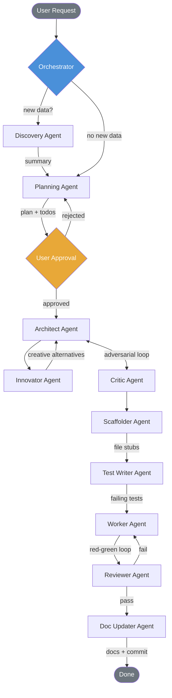
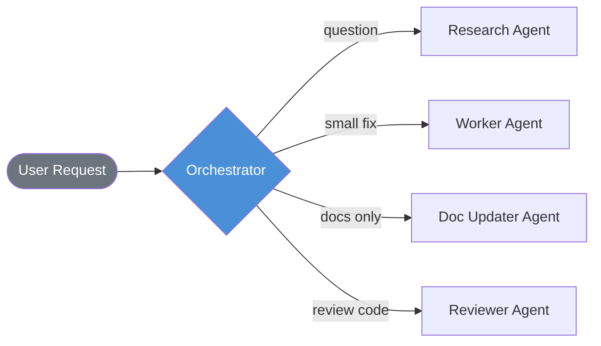

# Project Name

> Replace this with your project description. Agents will update this file as the project grows.
>
> **This repo was created from the [Agentic Project Template](TEMPLATE_README.md).**
> See that file for template docs (agents, prompts, DEEP_MODE, hooks).

## Setup

1. Run `scripts/setup.ps1` (Windows) or `scripts/setup.sh` (Unix) to install git hooks and create directories.
2. Copy `.env.example` to `.env` and fill in any required values.
3. Install your language's dependencies as usual.

## Usage

*TODO: Add usage instructions as the project develops.*

## Project Structure

```text
src/
├── utils/         → Shared helpers
├── services/      → Business logic
├── models/        → Data models / schemas
└── config/        → Configuration
tests/             → Unit & integration tests
scripts/           → Automation scripts & git hooks
docs/
├── discoveries/   → Structured summaries of analyzed data/codebases
├── files/         → Per-file documentation (one MD per source file)
├── API_DOCUMENTATION.md
├── BUSINESS_LOGIC.md
├── CODE_INVENTORY.md
└── PLAYBOOK.md
.ai/               → Agent memory (preferences, sessions, plans, traces, todos)
.github/           → Copilot instructions, custom agents, prompt files
```

*Agents will keep this structure tree updated.*

## Agent Workflow

This project uses an **Orchestrator** pattern — the main AI agent dispatches specialized sub-agents for each task. See [TEMPLATE_README.md](TEMPLATE_README.md) for full details.



For trivial tasks, the orchestrator skips directly to the needed agent:


