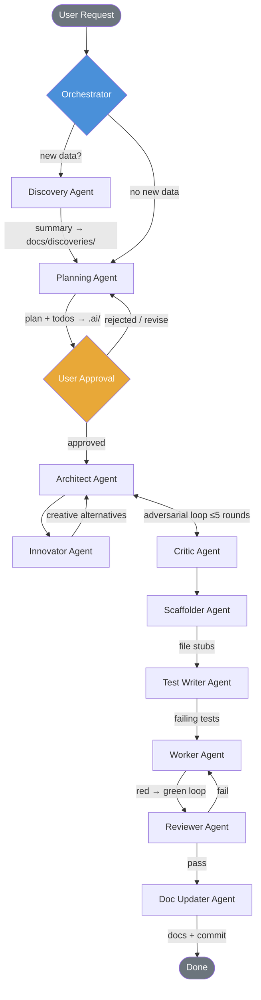
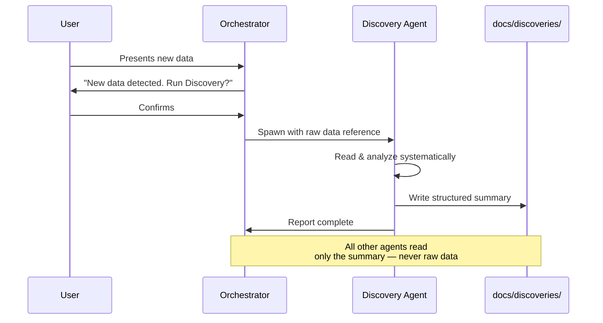
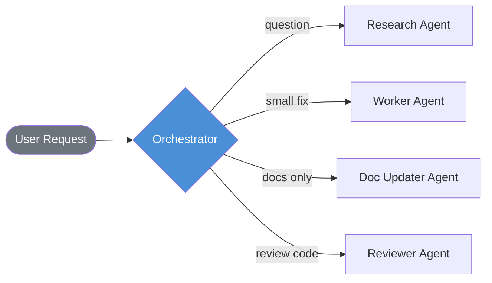
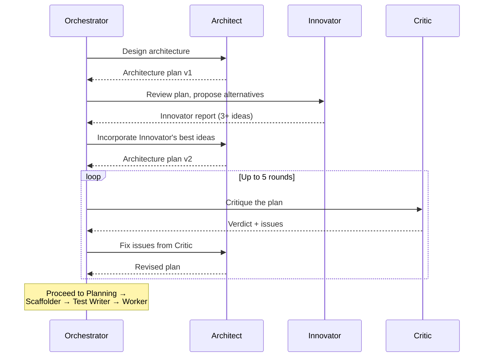

# Agentic Project Template

A repository template that gives AI coding agents **persistent memory**, **anti-duplication checks**, and **plan-driven workflows**. Use this as a starting point for any project where you work with AI assistants (GitHub Copilot, Cursor, Windsurf, Claude Code, etc.).

---

## What This Template Does

| Feature | How |
| --- | --- |
| **Prevents code duplication** | Agents search `docs/CODE_INVENTORY.md` before writing any new code |
| **Learns your preferences** | Agents append to `.ai/PREFERENCES.md` as they learn your style |
| **Plans before coding** | Non-trivial tasks get a `.plan.md` file before any code is written |
| **Delegates to sub-agents** | Plan steps marked `[delegatable]` can be spawned to isolated sub-agents |
| **Maintains a living playbook** | Architecture decisions accumulate in `docs/PLAYBOOK.md` across sessions |
| **Summarizes every session** | A concise summary is written to `.ai/sessions/` after each conversation |
| **Keeps README & .gitignore current** | Agents update these whenever project structure or tooling changes |

---

## Quick Start

1. **Use this template** — click "Use this template" on GitHub (or clone and remove `.git/`)
2. **Start coding with an AI agent** — the system instructions are loaded automatically
3. The agent will read the playbook, inventory, and preferences before doing anything
4. For new features, use `/plan-feature` to generate a plan before implementation
5. After implementation, use `/review-session` to get a quality check and session summary

---

## Project Structure

```text
.github/
├── copilot-instructions.md           # Master system prompt (auto-loaded by Copilot)
├── agents/
│   ├── architect.agent.md            # System design (DEEP_MODE)
│   ├── critic.agent.md               # Architecture review (DEEP_MODE)
│   ├── discovery.agent.md            # Analyzes new data/codebases
│   ├── doc-updater.agent.md          # Updates all documentation
│   ├── innovator.agent.md            # Creative alternatives & outside-the-box ideas
│   ├── planner.agent.md              # Creates plans and todos
│   ├── research.agent.md             # Investigates questions
│   ├── reviewer.agent.md             # Reviews changes
│   ├── scaffolder.agent.md           # Creates file stubs
│   ├── test-writer.agent.md          # Writes thorough tests
│   └── worker.agent.md               # Implements functions
├── prompts/
│   ├── plan-feature.prompt.md        # /plan-feature slash command
│   ├── implement-plan.prompt.md      # /implement-plan slash command
│   ├── review-session.prompt.md      # /review-session slash command
│   ├── update-inventory.prompt.md    # /update-inventory slash command
│   └── deep-implement.prompt.md      # /deep-implement slash command (DEEP_MODE)
└── instructions/                     # Path-specific instructions (add as needed)

.ai/
├── PREFERENCES.md                    # Agent-learned user preferences
├── DEEP_MODE.md                      # DEEP_MODE pipeline reference
├── TRACE_TEMPLATE.md                 # Execution trace template
├── sessions/                         # Per-conversation summaries
├── plans/                            # Implementation plan files
└── todos/                            # Persisted task tracking

docs/
├── discoveries/                      # Structured summaries of analyzed data
├── files/                            # Per-file documentation
├── API_DOCUMENTATION.md              # Exposed & consumed API registry
├── BUSINESS_LOGIC.md                 # System logic, data flows, modules
├── CODE_INVENTORY.md                 # Living registry of all code symbols
└── PLAYBOOK.md                       # Architecture decisions & patterns

src/                                  # Application source code
├── utils/                            # Shared helper functions and utilities
├── services/                         # Business logic and service layer
├── models/                           # Data models, schemas, types
└── config/                           # Configuration and environment setup

tests/                                # Unit and integration tests (mirrors src/)

scripts/
├── hooks/
│   ├── pre-commit                    # Linters, formatters, style checks
│   ├── commit-msg                    # Conventional commit validation
│   └── pre-push                      # Test runner before push
├── setup.ps1                         # Windows setup (dirs, hooks, deps)
└── setup.sh                          # Unix setup (dirs, hooks, deps)

AGENTS.md                             # Cross-tool agent instructions
README.md                             # Project README (agents keep updated)
TEMPLATE_README.md                    # This file — template documentation
.gitignore                            # Broad defaults, agent-maintained
.env.example                          # Placeholder for environment variables
```

---

## How the Agent Workflow Works

The **Orchestrator** (the main AI agent) is a pure dispatcher — it never writes code directly. It reads documentation, decides which sub-agents to spawn, and reports results.

### Full Pipeline (all tasks)



### Discovery (when new data appears)



### Trivial Tasks (shortcut)

Not every request needs the full pipeline. The orchestrator skips to the relevant agent(s).



### Architect–Innovator–Critic Loop

Every task goes through adversarial refinement before implementation. The Orchestrator mediates all communication — agents never hand off to each other directly.



---

## Slash Commands (Prompt Files)

| Command              | What it does                                                                         |
|----------------------|--------------------------------------------------------------------------------------|
| `/plan-feature`      | Analyze a feature request and produce a step-by-step plan                            |
| `/implement-plan`    | Execute a plan file step-by-step with sub-agent delegation                           |
| `/review-session`    | Review changes, check quality, write session summary                                 |
| `/update-inventory`  | Re-scan `src/` and regenerate the code inventory                                     |
| `/deep-implement`    | Full DEEP_MODE pipeline: architect → critic → plan → scaffold → test → implement     |

---

## Key Files for Agents

| File | Purpose | Updated by |
| --- | --- | --- |
| `docs/CODE_INVENTORY.md` | Registry of every function, class, const | Agent, after every code change |
| `docs/PLAYBOOK.md` | Architecture decisions & patterns | Agent, after design decisions |
| `docs/discoveries/*.md` | Summaries of analyzed data/codebases | Discovery Agent |
| `docs/API_DOCUMENTATION.md` | Exposed & consumed API registry | Worker / Doc Updater Agent |
| `.ai/PREFERENCES.md` | User's coding style preferences | Agent, when learning new preferences |
| `.ai/sessions/*.md` | Conversation summaries | Doc Updater Agent, at end of session |
| `.ai/plans/*.plan.md` | Implementation plans | Planning Agent, before implementation |
| `.ai/todos/*.todo.md` | Persisted task tracking | Planning Agent / Orchestrator |

---

## Customizing This Template

- **Language/framework specific rules**: Add files to `.github/instructions/` with `applyTo` globs
- **Custom agents**: Add `.agent.md` files to `.github/agents/` for specialized workflows
- **Prompt templates**: Add `.prompt.md` files to `.github/prompts/` for reusable slash commands
- **Playbook seeding**: Pre-fill `docs/PLAYBOOK.md` with your team's architecture decisions
