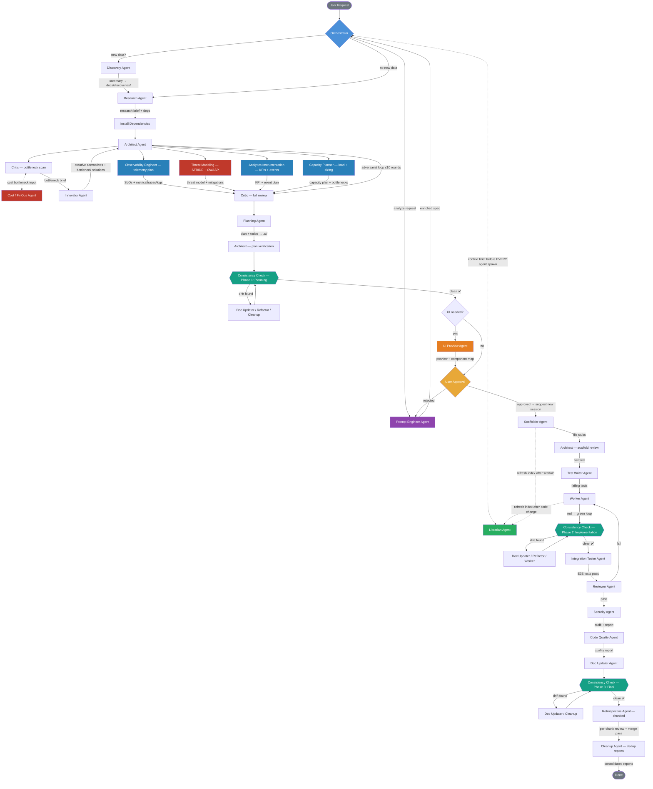

# Template Documentation

Full documentation of the agent template — what's in it, how it's organised, how to customise. This file complements [README.md](README.md) (project-level overview) and [AGENTS.md](AGENTS.md) (single source of truth for orchestrator behaviour).

> **License:** Proprietary. Personal use free; business use requires written permission from the author. See [LICENSE](LICENSE).

---

## Architecture in one paragraph

The Orchestrator is a **pure dispatcher** — it reads docs, decides which sub-agents to spawn, and reports results. It never writes code. Every concrete action is delegated to one of **50 specialised sub-agents** through `runSubagent`. Every sub-agent spawn is **preceded by a Librarian context-brief query** (the single context gateway). Work flows through one of **four named pipelines** (Planning, Change, Onboarding, Incident), each with **three Consistency Check gates** that block progress until drift is resolved. Tests are written **black-box** by Test Writer and Integration Tester — `scripts/tool-guard.py` physically blocks them from reading `src/` paths.

---

## Workflow Diagram (Full Planning Sequence)

The canonical pipeline. Every non-trivial task flows through this. The **Consistency Check Agent** is dispatched at every phase boundary (planning → implementation → review → done) and re-runs after fixes. The same three gates apply to the Change and Onboarding pipelines. Source of truth: [AGENTS.md](AGENTS.md).



---

## Sub-Agent Roster (50)

Each agent has one `.github/agents/{slug}.agent.md` (system prompt) paired with one `docs/playbooks/agents/{slug}.playbook.md` (versioned rules included in every Librarian brief).

### Core implementation loop

| Agent | Role |
| --- | --- |
| **Orchestrator** | Pure dispatcher. Reads docs, spawns sub-agents, reports back. (Defined in `AGENTS.md`, not as a sub-agent.) |
| **Librarian** | Single context gateway. Maintains knowledge index. Serves curated briefs to every other agent. |
| **Prompt Engineer** | Deeply analyses a raw user request; produces an enriched spec to feed the pipeline. |
| **Discovery** | Reads new data/codebases; produces structured summaries in `docs/discoveries/`. |
| **Research** | Web + codebase + docs research; produces a research brief with dependency list. |
| **Architect** | Designs system structure, decomposition, signatures. |
| **Innovator** | Generates creative alternatives, especially for parallelism and bottleneck removal. |
| **Critic** | Adversarial review of architecture and plans. Bottleneck-scan and full-review modes. |
| **Planning** | Function-level plans + todo files in `.ai/plans/` and `.ai/todos/`. |
| **Scaffolder** | Creates file stubs with signatures and docstrings. |
| **Test Writer** | Black-box (cannot read source). Writes ≥10 unit tests per function across the 12-category taxonomy, edge cases first. Contributes to the ≥50-tests-per-functionality floor. |
| **Mock Data Generator** | Single supplier of test fixtures, seed data, contract payloads. Realistic, schema-validated, locale-aware, deterministic. |
| **Worker** | Implements functions. Runs the red-green loop. |
| **Integration Tester** | Black-box. Writes 15+ integration / 5+ E2E / 1+ contract tests per feature in `tests/integration/`, `tests/e2e/`, `tests/contracts/`. Tops up the ≥50-tests-per-functionality floor. |
| **Reviewer** | Reviews implementations for quality, duplication, playbook compliance. |
| **Doc Updater** | Updates docs, writes session summaries, commits with conventional messages. |
| **Retrospective** | Reviews the full session transcript in chunks; updates the Playbook. |
| **Cleanup** | Removes dead code, unused imports, stale files. Onboarding audit-only mode. |
| **Consistency Check** | Audits drift between plans, code, docs, agent rosters, references. Spawned at every phase boundary. |

### Quality and security

| Agent | Role |
| --- | --- |
| **Security** | OWASP Top 10 + project security checklist. Appends to `docs/SECURITY_REPORT.md`. |
| **Threat Modeling** | Design-time STRIDE / OWASP review against the architecture. Pairs with Architect. |
| **Code Quality** | Duplication, smells, refactor opportunities. Appends to `docs/QUALITY_REPORT.md`. |
| **Refactor** | Restructures existing code without changing behaviour. |
| **Debug** | Diagnoses bugs from logs, stack traces, failing tests. |
| **Performance** | Profiles bottlenecks, complexity, memory issues. |
| **Type Safety** | Audits type coverage; finds unsafe casts, missing annotations. |
| **Error Handling** | Audits silent catches, missing context, swallowed exceptions. |
| **Dependency** | Audits dependency tree for outdated packages and license issues. |
| **Compliance** | License compliance, GDPR/CCPA, regulatory requirements. |
| **Accessibility** | WCAG compliance, screen reader, keyboard navigation. |
| **Migration** | Framework upgrades, API version bumps, language migrations. |
| **Deprecation Manager** | Owns the announce → warn → remove timeline for public surfaces. |

### Data and infrastructure

| Agent | Role |
| --- | --- |
| **Database** | Schema design, migrations, query optimisation, seed data. |
| **SQL Query** | Writes/reviews/optimises SQL. EXPLAIN plans, N+1 detection. |
| **Data Engineer** | ETL/ELT pipelines, warehouse models, lineage, schema evolution. |
| **API Design** | REST / GraphQL / gRPC contracts. OpenAPI / AsyncAPI. |
| **Config Management** | Env vars, feature flags, secrets, multi-environment config. |
| **Monitoring** | Audits observability infrastructure. Reports gaps. |
| **Observability Engineer** | Designs telemetry upfront — metrics, traces, logs, SLOs, dashboards. |
| **Cost / FinOps** | Cloud spend, cost-aware architecture, ROI validation. |
| **Capacity Planner** | Models load, fan-out, sizing, and SLO feasibility against the architecture before implementation. |
| **Analytics Instrumentation** | Business analytics — event taxonomy, KPIs, funnels, cohorts, experiment readiness. |
| **Load Testing** | Designs and analyses load test scenarios. SLO validation. |

### Frontend and UX

| Agent | Role |
| --- | --- |
| **UI Preview** | HTML/CSS preview mockups before scaffolding (user-approval gate). |
| **Frontend Component** | Builds accessible, performant UI components with design system compliance. |
| **Localization** | i18n / l10n — externalisation, plurals, RTL, locale formats. |
| **UX Research** | Usability tests, surveys, persona development. |

### Operations

| Agent | Role |
| --- | --- |
| **Incident Commander** | Triages live production incidents. Owns the Incident Response Pipeline. |
| **Vendor Evaluator** | Build-vs-buy, license, lock-in, total cost — before adoption. |
| **Doc-Site Generator** | User-facing docs — getting-started, tutorials, how-tos, reference, runbooks, migrations. Distinct from Doc Updater (internal docs). |
| **Git / Release** | Changelogs, semantic versioning, release notes, tag creation. |

---

## Slash commands (prompt files)

Each lives in `.github/prompts/*.prompt.md`. Invoke with the leading slash in chat (Copilot) or by referencing the file in other tools.

| Command | Pipeline | Step range | Use when |
| --- | --- | --- | --- |
| `/plan-only` | Planning Sequence | Phase A (steps 1–14) | Overnight / batch planning. Stops at User Approval. |
| `/implement-plan` | Planning Sequence | Phase B (steps 15–25) | Resume from a saved Phase A plan in a fresh session. |
| `/plan-and-implement` | Planning Sequence | 1–25 (single session) | Small task, full flow in one chat. |
| `/deep-implement` | Planning Sequence | 1–25 | Legacy alias of plan-and-implement. |
| `/plan-feature` | Planning Sequence | Lightweight | Single-feature plan without the full unattended-overnight overhead. |
| `/onboard-project` | Onboarding Pipeline | 7 phases | Audit and document an existing codebase. |
| `/incident-response` | Incident Response | 7 phases | Live production incident — declare, stabilize, investigate, fix, postmortem. |
| `/review-session` | Ad-hoc | Run Security + Code Quality + Reviewer + Doc Updater retrospectively. |
| `/update-inventory` | Ad-hoc | Re-scan `src/` and regenerate `docs/CODE_INVENTORY.md` + `docs/files/`. |
| `/security-audit` | Ad-hoc | Spawn Security Agent against the full project against `docs/SECURITY_CHECKLIST.md`. |
| `/refactor-code` | Ad-hoc | Spawn Refactor Agent on a target module — behaviour-preserving restructure. |
| `/optimize-performance` | Ad-hoc | Spawn Performance Agent — profile, identify bottlenecks, propose fixes. |
| `/design-api` | Ad-hoc | Spawn API Design Agent — produce / review OpenAPI / GraphQL contracts. |
| `/debug-issue` | Ad-hoc | Spawn Debug Agent autonomously on a known failure. |

In addition, **Quick Commands** (defined in [AGENTS.md](AGENTS.md)) trigger pipelines without slash syntax: `onboard`, `change`, `incident`, `down`, `outage`, `evaluate`, `deprecate`, `cost`, `plan only`, `implement plan`, `plan and implement`, `abort`.

---

## Pipelines

The four pipelines are the only top-level workflows. See [AGENTS.md](AGENTS.md) for full step-by-step prose and the canonical Mermaid workflow diagram.

| Pipeline | Steps | Phase boundaries (Consistency Check gates) |
| --- | --- | --- |
| **Planning Sequence** | 1–25, split into Phase A (1–14, no code) and Phase B (15–25, implementation) | After step 12, after step 18, after step 23 |
| **Change Pipeline** | 1–22 — modifications to existing code | After step 12, after step 15, after step 20 |
| **Onboarding Pipeline** | 7 phases — read-only audit of an existing project | After Phase 2, after Phase 5, after Phase 6 |
| **Incident Response Pipeline** | 7 phases — live production incidents owned by Incident Commander | After Phase 7 (postmortem) |

Planning Sequence Phase B (steps 17–25) and Change Pipeline (steps 14–22) share an identical **Implementation Core** — Test Writer → Worker → Integration Tester → Reviewer → Security → Code Quality → Doc Updater → Retrospective → Cleanup. Maintain in lockstep.

A **Cross-Pipeline Step Matrix** in [AGENTS.md](AGENTS.md) shows every agent's slot in every pipeline at a glance.

---

## Black-box testing

This is a hard architectural rule, not a guideline.

- **Test Writer** writes unit tests from function signatures, docstrings, type annotations, and the Librarian's brief — never from source.
- **Integration Tester** writes integration / E2E / contract tests from `docs/API_DOCUMENTATION.md`, `docs/BUSINESS_LOGIC.md`, and observable system behaviour — never from source.
- Both are listed in `SOURCE_READ_DENIED_AGENTS` in [scripts/tool-guard.py](scripts/tool-guard.py). The PreToolUse hook returns a `deny` decision when either tries to `read_file` / `grep_search` / `semantic_search` against `src/` paths.
- The 12-category taxonomy is enforced as a minimum — see [.github/agents/test-writer.agent.md](.github/agents/test-writer.agent.md) and [.github/skills/testing-rules/SKILL.md](.github/skills/testing-rules/SKILL.md).

Counts:

| Layer | Minimum | Where |
| --- | --- | --- |
| Unit tests | ≥10 per function across 12 categories (edge cases first) | `tests/` (mirrors `src/`) |
| Integration | 15+ per feature | `tests/integration/` |
| E2E | 5+ per user-facing feature | `tests/e2e/` |
| Contract | 1+ per consumer↔provider pair | `tests/contracts/` |

---

## Tool restrictions (PreToolUse hook)

[.ai/TOOL_MANIFEST.md](.ai/TOOL_MANIFEST.md) is the source of truth. [scripts/tool-guard.py](scripts/tool-guard.py) enforces it.

| Restriction category | Denied agents | Allowed agents |
| --- | --- | --- |
| Web access (`fetch_webpage`, `mcp_playwright_*`, `open_browser_page`) | Everyone except Research | Research |
| Source-file reads (`read_file` / `grep_search` / `semantic_search` on `src/` paths) | Test Writer, Integration Tester | All others |

To add a new restriction: update [.ai/TOOL_MANIFEST.md](.ai/TOOL_MANIFEST.md), update [scripts/tool-guard.py](scripts/tool-guard.py), and ensure the Librarian includes the restriction in the relevant agent's context brief.

---

## Playbooks

Every agent has one paired playbook in `docs/playbooks/agents/{slug}.playbook.md` with TOML `+++` frontmatter:

```toml
+++
id = "agents/test-writer"
title = "Test Writer Agent Rules"
agents = ["test-writer"]
technologies = ["all"]
category = "rule"
tags = ["test-writer"]
version = 5
+++
```

Plus shared playbooks in `docs/playbooks/shared/` (e.g. `telemetry-conventions`, `cost-aware-design`).

`scripts/validate-playbooks.py` checks every `.playbook.md` parses cleanly and IDs are unique. Wire it into a pre-commit or pre-push hook.

The Librarian includes the relevant playbook subset in every context brief — keep playbooks focused, versioned, and free of drift.

---

## Persistent reports

Created and appended-to during pipeline runs. Treat as auditable history.

| Report | Owner | Updated when |
| --- | --- | --- |
| `docs/SECURITY_REPORT.md` | Security Agent | After every Planning Sequence step 21 / Change Pipeline step 18 |
| `docs/QUALITY_REPORT.md` | Code Quality Agent | After every Planning Sequence step 22 / Change Pipeline step 19 |
| `docs/REVIEW_REPORT.md` | Reviewer | After every Planning Sequence step 20 / Change Pipeline step 17 |
| `docs/RETROSPECTIVE_REPORT.md` | Retrospective Agent | End of every session |
| `docs/CONSISTENCY_REPORT.md` | Consistency Check Agent | At every phase boundary in every pipeline |
| `docs/CLEANUP_REPORT.md` | Cleanup Agent | Onboarding Phase 4b; periodically |
| `docs/STRUCTURE_REVIEW.md` | Architect (structure-review mode) | Onboarding Phase 4a |
| `docs/INTEGRATION_PLAN.md` | Integration scaffolding | Setup |

Templates for each live in `docs/_TEMPLATE.*.md`.

---

## Customising the template

### Add a new agent

1. Create `.github/agents/{slug}.agent.md` — system prompt, scope, rules, output format.
2. Create `docs/playbooks/agents/{slug}.playbook.md` with TOML frontmatter (use `docs/playbooks/_TEMPLATE.playbook.md`).
3. Add a row to the Sub-Agent Roster in [AGENTS.md](AGENTS.md).
4. Add a row to the Cross-Pipeline Step Matrix in [AGENTS.md](AGENTS.md) showing where the agent runs.
5. If the agent slots into a pipeline, insert with a letter-suffix step number (e.g. `13a`) — **never renumber existing steps** (Numeric Stability rule).
6. If the agent has tool restrictions, update `.ai/TOOL_MANIFEST.md` and `scripts/tool-guard.py`.
7. Run `scripts/validate-playbooks.py` to confirm the new playbook parses.

### Add a slash command

1. Create `.github/prompts/{name}.prompt.md`.
2. Reference [AGENTS.md](AGENTS.md) step ranges in the header (e.g. "Maps to Planning Sequence Phase B steps 15–25").
3. Add a row to the Quick Commands table in [AGENTS.md](AGENTS.md) if it's a top-level command.

### Add a skill

1. Create `.github/skills/{skill}/SKILL.md` with frontmatter (`name`, `description`).
2. The description's first sentence determines when the skill auto-loads.

### Add language-scoped rules

Create `.github/instructions/{lang}.instructions.md` with `applyTo` glob:

```yaml
---
description: Python coding conventions
applyTo: "**/*.py"
---
```

### Pre-fill the playbook

Seed `docs/PLAYBOOK.md` with your team's architecture decisions before running the first session. The Architect and Critic will read it and respect existing patterns.

---

## Project structure

See [README.md](README.md#project-structure) for the full tree. Highlights:

```text
AGENTS.md            — single source of truth (read first)
LICENSE              — proprietary; business use requires permission
.github/agents/      — 50 agent system prompts
.github/prompts/     — slash commands
.github/skills/      — on-demand domain knowledge
.github/instructions/— language/framework rules
.ai/                 — agent memory (preferences, sessions, plans, todos, lessons)
docs/                — project documentation + playbooks + reports
docs/playbooks/agents/   — 50 paired playbooks
docs/playbooks/shared/   — cross-cutting playbooks
scripts/             — setup, hooks, tool-guard, playbook validator
```

---

## Maintenance discipline

- **Numeric stability:** never renumber pipeline steps. Inserts use letter suffixes.
- **Implementation Core lockstep:** Planning Phase B (17–25) and Change Pipeline (14–22) share identical steps — change them together.
- **Cross-Pipeline Step Matrix:** update the table in [AGENTS.md](AGENTS.md) whenever an agent's slot changes.
- **Validate playbooks:** wire `scripts/validate-playbooks.py` into a pre-commit hook.
- **Consistency Check gates:** the Consistency Check Agent runs at every phase boundary, **sharded into one parallel instance per drift category plus a merge instance** for any project with ≥30 source files. Let it block progress when drift is found.
- **Parallel sub-agent dispatch (fan-out / sharding):** a single sub-agent instance is the default — but whenever the work splits cleanly along an independent axis (drift category, transcript chunk, source module, function, audit dimension), the Orchestrator MUST fan out into multiple parallel instances of the same agent and then run one merge instance. Already-explicit fan-outs: Test Writer (per function), Worker (per function), Retrospective (per transcript chunk + merge), Onboarding Phase 3 audits (six audit agents in parallel), Consistency Check (per drift category + merge). General targets: Discovery (per top-level module on large codebases), Doc Updater (per affected docs subtree on large changes), Reviewer / Code Quality / Security (per module on large surfaces). Each shard receives its own Librarian-scoped brief; shards are spawned in a single parallel `runSubagent` block; a merge instance consolidates the sub-reports.

---

## License

Proprietary. Personal use is free under the terms in [LICENSE](LICENSE). **Business use requires written permission from the author** — contact **Dominik Haspra <dominik.haspra@gmail.com>**.
